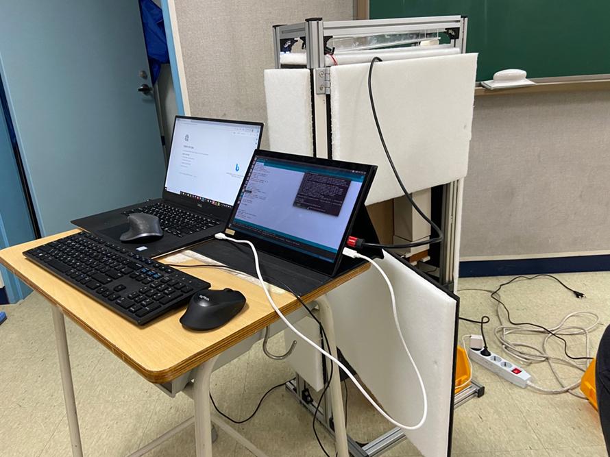
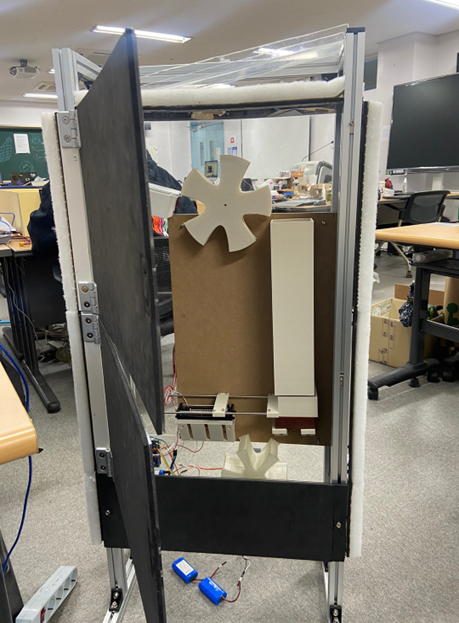

<div align="center">

# 🏆 BrokenGolfBallClassifier

### 제21회 임베디드 소프트웨어 경진대회  
### 자유공모 부문 **산업통상자원부장관상** 수상작

---

```


🥇  2023 임베디드SW경진대회 · 자유공모부문 · 산업통상자원부장관상
```

---

[](https://github.com/KuriosKat/BrokenGolfBallClassifier)
[](https://github.com/KuriosKat/BrokenGolfBallClassifier)
[](https://python.org)
[](https://isocpp.org)
[](LICENSE)

---

> 🎵 *"소리로 판별한다."*  
> 타격음 분석 기반 머신러닝으로 파손 골프공을 실시간으로 분류하는 임베디드 AI 시스템

</div>

---

## 🥇 수상 정보

<table>
<tr>
<td width="50%" align="center">

### 🏅 수상 내역

| 항목 | 내용 |
|------|------|
| 🎖️ **대회명** | 제21회 임베디드 소프트웨어 경진대회 |
| 📂 **부문** | 자유공모 |
| 🏆 **수상** | **산업통상자원부장관상** |
| 📅 **연도** | 2023년 |
| 🏢 **주관** | 임베디드소프트웨어산업협의회 |

</td>
<td width="50%" align="center">

### ⚙️ 지원 플랫폼

| 플랫폼 | 역할 |
|--------|------|
| 🟢 **Arduino** | 모터 제어 · 하드웨어 인터페이스 |
| 🔵 **Infineon TC375** | 임베디드 추론 · 실시간 제어 |
| 🐍 **Python (PC)** | 모델 학습 · 데이터 수집 |

</td>
</tr>
</table>

---

## 📌 프로젝트 개요

골프공은 내부가 파손되어도 **외관상으로는 멀쩡해 보이는 경우**가 많습니다.  
기존의 시각적 검사 방식으로는 이를 탐지하기 어렵고, 비용도 높습니다.

**BrokenGolfBallClassifier**는 이 문제를 완전히 다른 방식으로 해결합니다.

> 골프공을 **타격하여 발생하는 음향 데이터**를 수집하고,  
> 머신러닝 모델이 정상/파손 여부를 **자동으로 분류**합니다.

비접촉·비파괴 방식의 이 시스템은 **임베디드 환경(TC375, Arduino)**에서도  
실시간으로 동작하도록 설계되었습니다.

---

## 🔬 시스템 파이프라인

```
┌─────────────────────────────────────────────────────────────┐
│                     HARDWARE LAYER                          │
│                                                             │
│   [Golf Ball]                                               │
│       │                                                     │
│       ▼ 타격 (Solenoid / 모터)                              │
│   [Microphone] ──► 음향 데이터 수집                        │
│       │                                                     │
│       ▼                                                     │
│   [Arduino / TC375] ──► 제어 신호 · 트리거 · 분류기 추론   │
└───────────────────────────┬─────────────────────────────────┘
                            │
                            ▼ 음향 데이터 전송
┌─────────────────────────────────────────────────────────────┐
│                     SOFTWARE LAYER                          │
│                                                             │
│  record_model.py        ──►  실시간 음향 녹음 및 저장       │
│  Golfball_classifier_train.py ──►  ML 모델 학습            │
│                                                             │
│  ┌──────────┐    ┌──────────┐    ┌──────────────────────┐  │
│  │  MFCC    │───►│ ML Model │───►│  BROKEN / NORMAL     │  │
│  │ Feature  │    │(Classifier)│  │  판별 결과 출력      │  │
│  └──────────┘    └──────────┘    └──────────────────────┘  │
└─────────────────────────────────────────────────────────────┘
```

---

## ⚙️ TC375 임베디드 지원

이 프로젝트는 **Infineon AURIX™ TC375** 기반 임베디드 시스템에서도 동작합니다.

| 항목 | 내용 |
|------|------|
| **MCU** | Infineon AURIX™ TC375 (TriCore 아키텍처) |
| **역할** | 음향 트리거 제어, 분류 결과에 따른 실시간 소팅 |
| **특징** | 기능 안전(ISO 26262) 대응 가능한 산업용 MCU |
| **장점** | 낮은 레이턴시, 고신뢰성 임베디드 추론 환경 |

> Arduino 기반 프로토타입에서 검증된 로직을  
> TC375 환경으로 포팅하여 **산업 현장 수준의 신뢰성**을 확보합니다.

---

## 🚀 시작하기

### 사전 요구사항 설치

```bash
pip install -r requirements_GolfBall.txt
```

### Step 1 — 데이터 수집

```bash
python record_model.py
```
> 마이크를 통해 골프공 타격음을 녹음하고  
> `0519_BROKEN/` 또는 `0519_NORMAL/` 폴더에 저장합니다.

### Step 2 — 모델 학습

```bash
python Golfball_classifier_train.py
```
> 수집된 음향 데이터에서 **MFCC(Mel-Frequency Cepstral Coefficients)** 피처를 추출하고  
> 머신러닝 분류 모델을 학습합니다.

### Step 3 — 하드웨어 연동

```
Arduino IDE에서 Arduino_motorControl.ino 업로드
```
> 소레노이드/모터 제어 로직을 Arduino에 업로드합니다.  
> TC375 환경에서는 해당 제어 로직을 AURIX™ Development Studio로 이식하여 사용합니다.

### Step 4 — 실시간 분류 실행

```
학습된 모델 + 하드웨어 연동 → 골프공 투입 → 자동 분류 및 소팅
```

---

## 📁 파일 구조

```
BrokenGolfBallClassifier/
│
├── 🎵  0519_BROKEN/                   # 파손 골프공 음향 데이터셋
├── 🎵  0519_NORMAL/                   # 정상 골프공 음향 데이터셋
│
├── 🐍  record_model.py                # 음향 데이터 녹음·수집 스크립트
├── 🐍  Golfball_classifier_train.py   # ML 모델 학습 스크립트
├── ⚡  Arduino_motorControl.ino       # Arduino 모터 제어 코드 (C++)
├── 📦  requirements_GolfBall.txt      # Python 의존성 패키지 목록
│
└── 📄  LICENSE                        # MIT License
```

---

## 🧠 기술 스택

| 분야 | 기술 |
|------|------|
| **음향 처리** | librosa, MFCC Feature Extraction |
| **머신러닝** | scikit-learn |
| **데이터 수집** | sounddevice / pyaudio |
| **임베디드 (프로토타입)** | Arduino (C++) |
| **임베디드 (산업용)** | Infineon AURIX™ TC375 |
| **개발 언어** | Python 87.7% · C++ 12.3% |

---

## 💡 핵심 아이디어

| 기존 방식 | 본 프로젝트 |
|-----------|-------------|
| 👁️ 시각적 외관 검사 | 🎵 타격음 기반 음향 분석 |
| ❌ 내부 파손 탐지 불가 | ✅ 내부 구조 파손까지 탐지 |
| 💸 고비용 장비 필요 | 💚 저비용 마이크 + 임베디드 MCU |
| 🐢 수동 검사 | ⚡ 실시간 자동 소팅 |

---

<div align="center">

**🏆 제21회 임베디드 소프트웨어 경진대회 · 자유공모 · 산업통상자원부장관상**

*소리가 보이지 않는 균열을 발견한다.*

[](https://github.com/KuriosKat)

</div>
